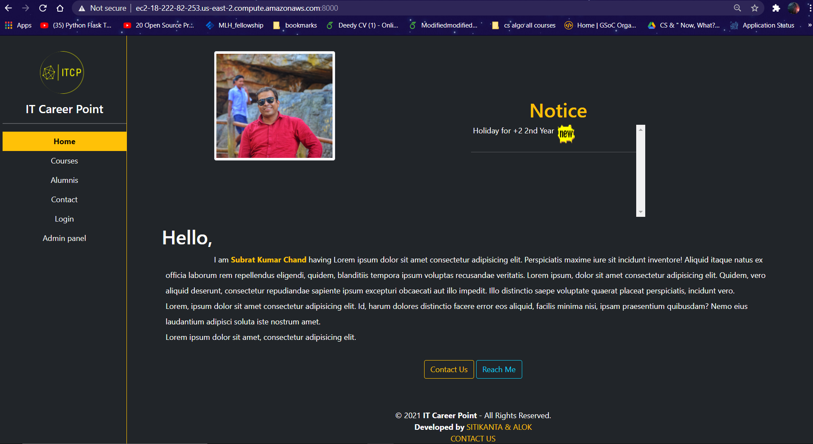
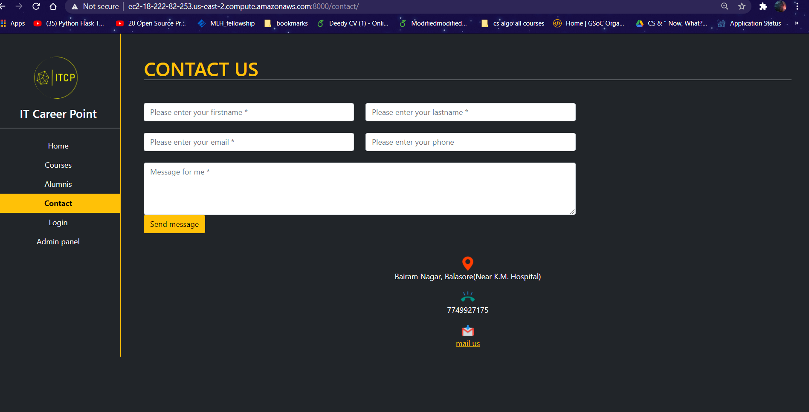

# ITCP
 A django based site made for a local tutorial.In this site registered students can log in and download their learning materials.It has a notice section where the admin can upload holidays and can also give assignment due date.New students can also contact the tutor using contact page.
 

### Languages and Tools

<!--  -->

 

### Tech Stack
Backend: Django

Frontend: Html,Css,Bootstrap

Database: Postgresql

Cloud:aws

This site is hosted on aws EC2 instance with aws RDS(postgresql) working as a database.The aws S3 is working as Staticfilestorage as well as Media Filestorage.

### Screenshots from the site

   
  

### Developed By
[Sitikanta Panigrahi](https://github.com/sitispeaks) 
